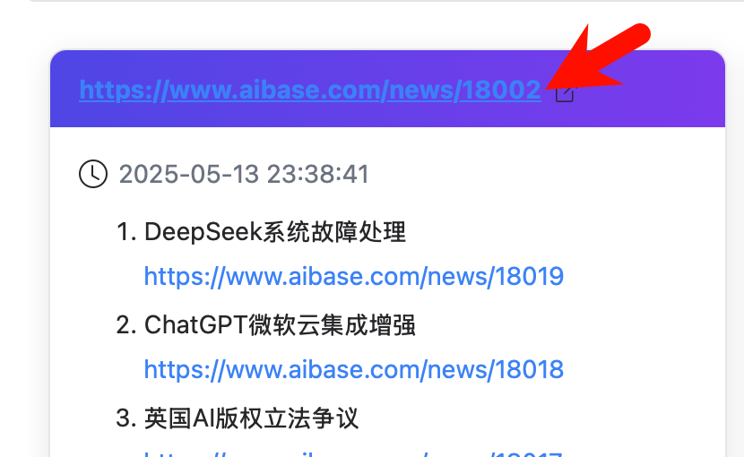
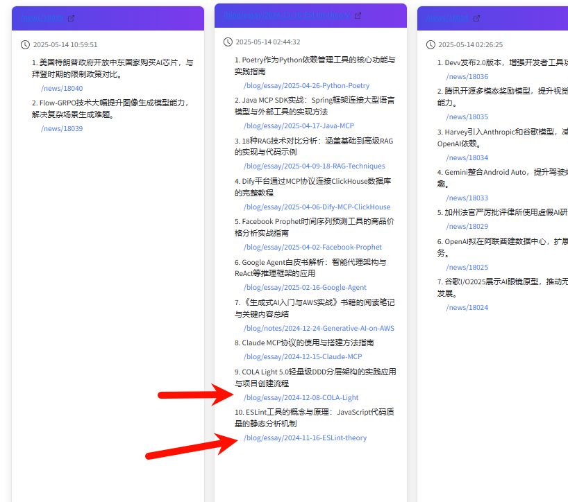
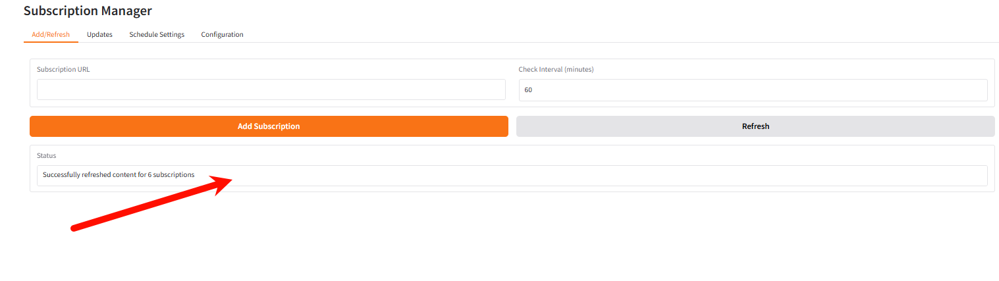
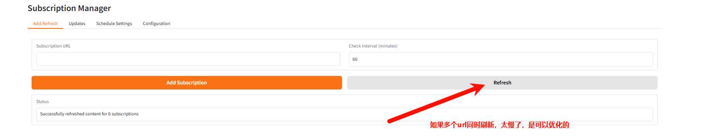
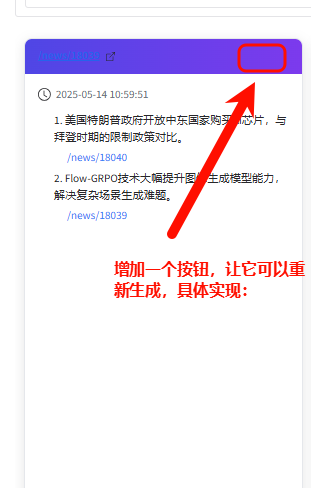
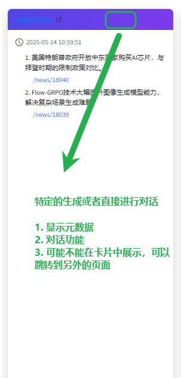

# 开发日志

## 待完成

### bug

- 卡片的左上角url有问题
  

- ai生成了很多无效url，需要修复
  

### 优化

- 更新的时候status一直空闲，可以拿来展示日志
  

- 更新的时候是顺序执行的，太慢了，可以用异步操作
  

### 功能

- 一键重新生成总结
  

- 特定需求重新总结或者对话
  

- [ ] 实现用户订阅功能
  - [ ] 创建订阅界面
  - [ ] 添加邮件通知
- [ ] 数据管理功能
  - [ ] 批量导入/导出
- [ ] 改进用户界面
  - [ ] 小程序适配
- [ ] Agent完善，
  - [ ] 爬取的摘要进行总结
  - [ ] 论文质量打分然后排序

## 更新记录

### v1.1.2  （ - 暂未发布）

fix:
  1. 一般页面的爬虫，即通用爬虫，也增加了爬取<a>标签url，最后的内容总结也可以总结出来了

### v1.1.1  2025.05.12
fix：
  1. summary函数中增加特性，对超长文本进行分块，并做内存记忆，目前支持任意长度文本

### v1.1.0  2025.05.01
add：
  1. 对特定网页（如arxiv）进行优化，支持内容总结与文章url一一对应输出

### v1.0.0  2025.05.01
正式发布了啦！
features：
  1. 添加URL和检查时间间隔以进行订阅
  2. 通过网页删除sqlite中的数据
  3. 查看订阅更新内容
  4. 设置定时器，以设定时间检查内容更新
  5. 使用ai对更新内容进行总结
  6. 支持切换智谱和阿里两个平台的API和模型

## 放弃的功能

2025-04-29 想要写一个程序，直接将现有的源码以及环境复制到releases（），生成可以直接点击exe运行的发布版本，但是感觉生成时间太久了，不如直接手动复制了
