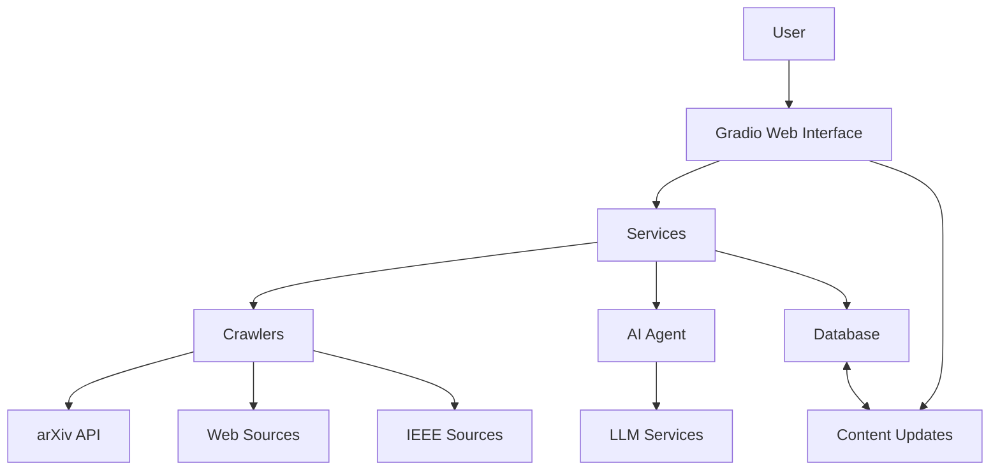
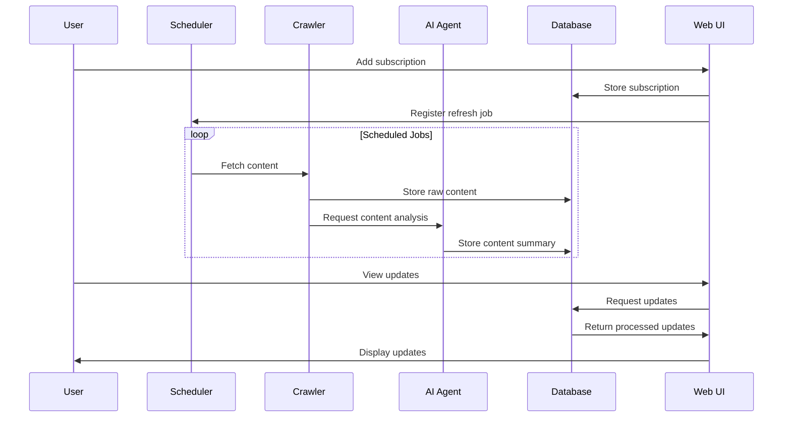
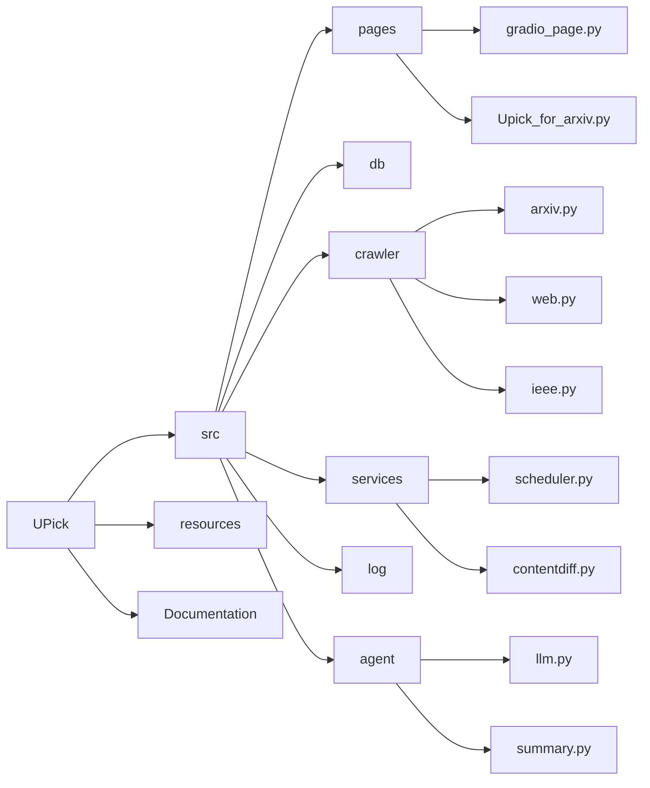
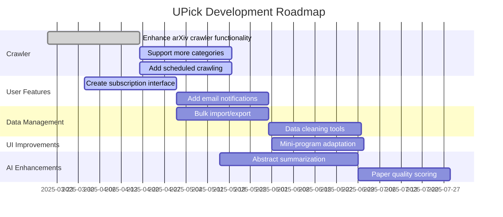

# UPick Project Architecture

UPick is a subscription management system with a focus on academic paper tracking, particularly from sources like arXiv. The system crawls content, analyzes changes, and presents updates through a Gradio-based web interface.

## System Components

## Data Flow

## Directory Structure

## Key Components Description

### Crawlers
- **ArxivCrawler**: Specialized crawler for extracting papers from arXiv
- **WebCrawler**: General-purpose web crawler for subscription content
- **IEEECrawler**: Specialized crawler for IEEE publications

### AI Agent
- **Summary**: Uses LLM to analyze content changes and generate summaries
- **LLM**: Interface to language model services

### Services
- **Scheduler**: Manages periodic content refreshing using APScheduler
- **ContentDiff**: Detects changes between content versions

### Web UI
- **Gradio Interface**: User-friendly interface for managing subscriptions and viewing updates
- **Upick_for_arxiv**: Specialized UI for arXiv paper tracking

## Technology Stack

- **Backend**: Python
- **Web Framework**: Gradio
- **Database**: SQLite
- **Scheduler**: APScheduler
- **AI**: LangChain, OpenAI (or alternative LLM providers)
- **Web Crawling**: BeautifulSoup, Requests
- **Data Processing**: JSON, Pydantic

## Development Roadmap

