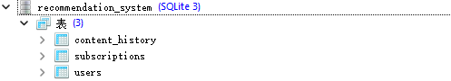
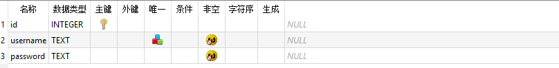
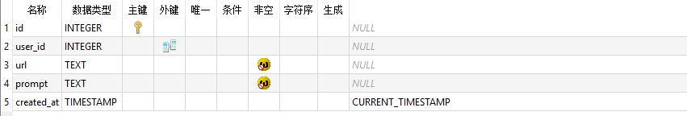

# UPick

`注意：` 使用之前需要在config/config2.yaml中配置api_key

## Database information （数据库结构）
有三个表：用户信息，订阅信息和订阅网站内容历史记录表

### 1. users（用户信息表）

- id: INTEGER PRIMARY KEY AUTOINCREMENT
  - 主键，自增，用户唯一标识符
- username: TEXT UNIQUE NOT NULL
  - 用户名，唯一且不能为空
- password: TEXT NOT NULL
  - 密码（哈希存储），不能为空
### 2. subscriptions（订阅信息表）

- id: INTEGER PRIMARY KEY AUTOINCREMENT
  - 主键，自增，订阅唯一标识符
- user_id: INTEGER
  - 外键，关联 users 表的 id，标识订阅所属用户
- url: TEXT NOT NULL
  - 订阅的URL地址，不能为空
- prompt: TEXT NOT NULL
  - 订阅的提示词/描述，不能为空
- created_at: TIMESTAMP DEFAULT CURRENT_TIMESTAMP
  - 创建时间，默认当前时间戳
- FOREIGN KEY (userthead_id) REFERENCES users(id)
  - 外键约束，关联 users 表

### 3. content_history（内容历史记录表）

- id: INTEGER PRIMARY KEY AUTOINCREMENT
  - 主键，自增，记录唯一标识符
- subscription_id: INTEGER
  - 外键，关联 subscriptions 表的 id，标识内容所属订阅
- content_hash: TEXT
  - 内容的哈希值，用于去重
- content_text: TEXT
  - 爬取的原始内容文本
- content_url: TEXT
  - 内容来源的URL地址
- status: INTEGER DEFAULT 0
  - 状态标记（例如：0=未读，1=已读），默认值为0
- recorded_at: TIMESTAMP DEFAULT CURRENT_TIMESTAMP
  - 记录时间，默认当前时间戳
- FOREIGN KEY (subscription_id) REFERENCES subscriptions(id)
  - 外键约束，关联 subscriptions 表

## API Documentation

### WebCrawler 
src.data_processing.web_crawler.WebCrawler
提供爬取网页的内容，并支持将内容保存到数据库中

这个 `WebCrawler` 类是一个用于爬取网页内容并将其存储到 SQLite 数据库中的工具，主要用于支持推荐系统的数据收集功能。以下是它的功能描述：

1. **初始化 (`__init__`)** 传入用户名

2. **网页内容爬取 (`crawl_raw_content`)**

3. **内容存储到数据库 (`save_to_db`)**

4. **爬取并存储 (`crawl_and_store`)**

### AgentCaller

src.services.AgentCaller 用于调用定义好的智能体类，通过传入内容和提示词，调用智能体进行回复。

  